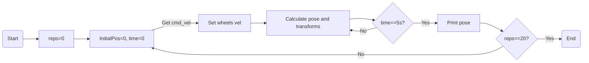
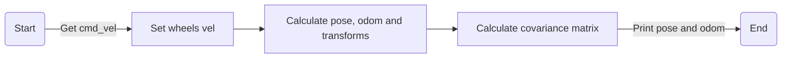
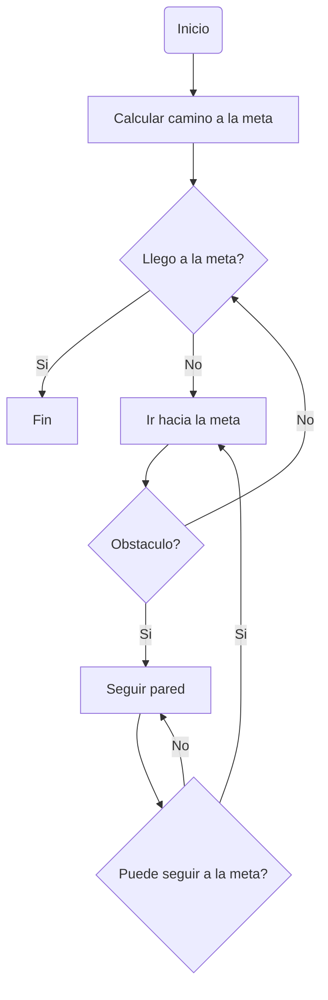
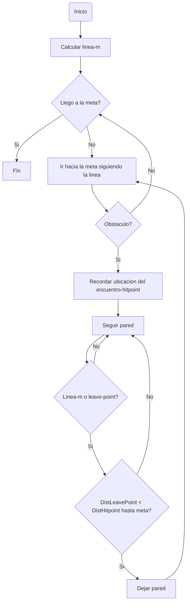

# PuzzlebotLidar3003B
Repositorio de Puzzlebot con un Lidar

# Reto Semana 1
Diseño de modelo cinematico para el puzzlebot asi como su simulacion en RVIZ y Gazebo
## Correr el programa
### Simulacion en Rviz
```
roslaunch puzzlebot_rviz puzzlebot_rviz.launch
```
### Simulacion en Gazebo
```
roslaunch puzzlebot_gazebo puzzlebot_gazebo.launch
```
### Nodo parte 1
```
rosrun puzzlebot_sim puzzlebotkinematic_model.py
```
*Incluido en los archivos launch*

### Nodo parte 2
```
rosrun puzzlebot_sim time_control.py
```
*NO incluido en los archivos launch*

## Diagrama de flujo


# Reto Semana 2
## Diagrama de flujo


# Reto Semana 4
BUG0

   
BUG2


# Reto Semana 5
