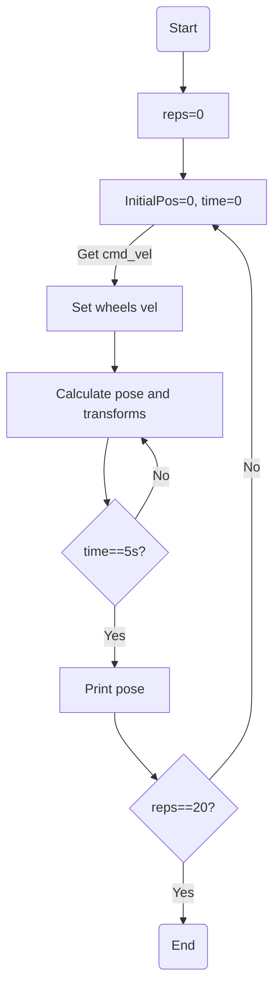

# PuzzlebotLidar3003B
Repositorio de Puzzlebot con un Lidar
# Correr Proyecto
```
roslaunch manchester_week1 puzzlebot.launch
```
# Reto Semana 1
Diseño de modelo cinematico para el puzzlebot asi como su simulacion en RVIZ y Gazebo
### Diagrama de flujo

```
roslaunch manchester_week1 puzzlebot.launch py:=puzzlebot.py
```
# Reto Semana 2
```
roslaunch manchester_week1 puzzlebot.launch py:=odometry.py
```
# Reto Semana 3
# Reto Semana 4
# Reto Semana 5
